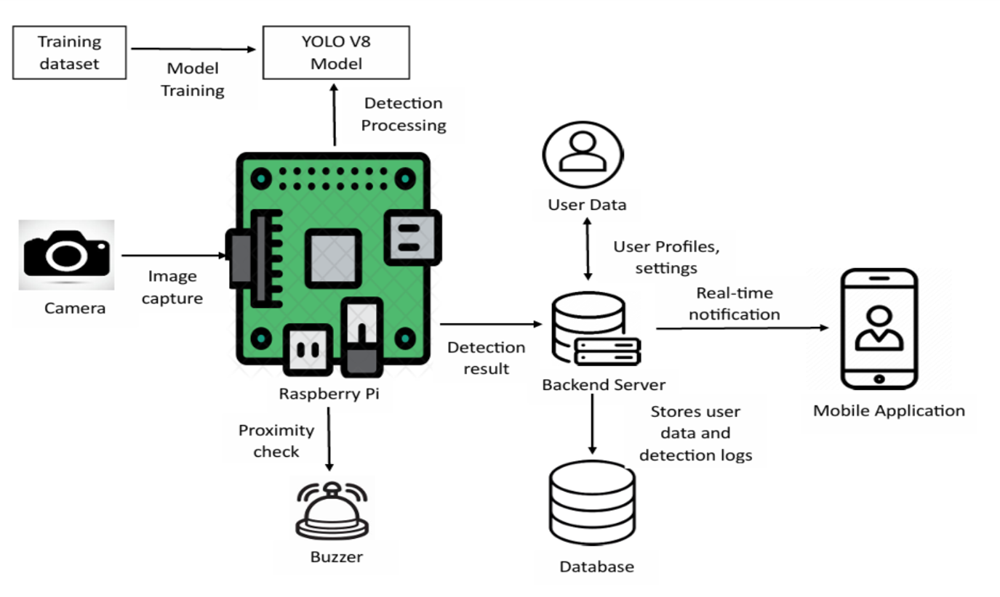

# wildguard - Wild Animal Detection and Alert System

WildGuard is a smart surveillance system designed to prevent human-animal conflict, especially in forest-border areas or rural zones. It uses a real-time object detection model to identify wild animals through a connected camera and sends instant alert SMS to registered users via Twilio. Additionally, it triggers a buzzer sound to warn people nearby.

### 🎯 Objective
- To develop a real-time alert system that:

- Detects the presence of wild animals (like elephants, bears, etc.)

- Sends SMS alerts to registered users

- Provides safety tips through a mobile application

- Triggers a buzzer for local sound-based alerts

### 🔧 Tech Stack
- Object Detection Model: YOLOv8

- Hardware: Raspberry Pi 4, USB Webcam, Active Buzzer Module

- Backend: Python

- SMS Integration: Twilio API

- Database: Firebase Firestore

- Mobile App: Firebase Dynamic Links to open the Android app

- Libraries: OpenCV, ultralytics, RPi.GPIO, Twilio, Firebase Admin SDK

⚙️ System Architecture

For help getting started with Flutter development, view the
[online documentation](https://docs.flutter.dev/), which offers tutorials,
samples, guidance on mobile development, and a full API reference.
